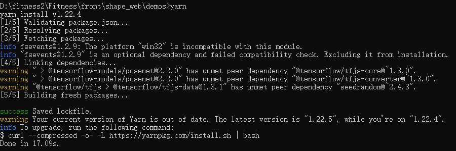
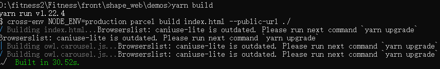
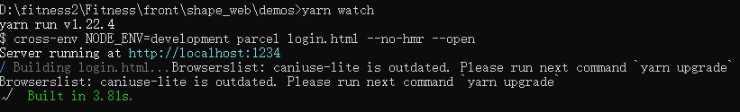
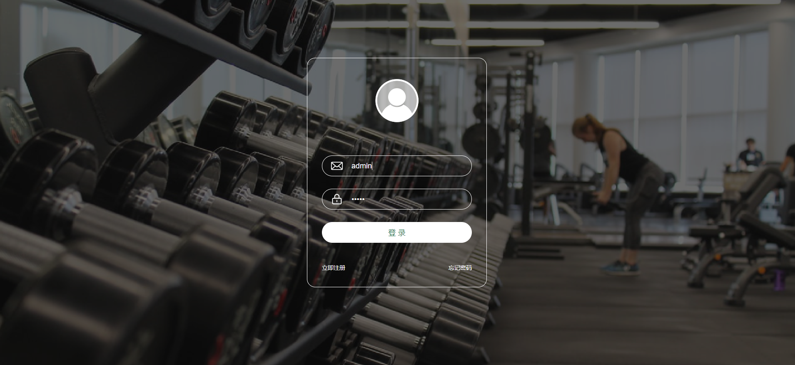
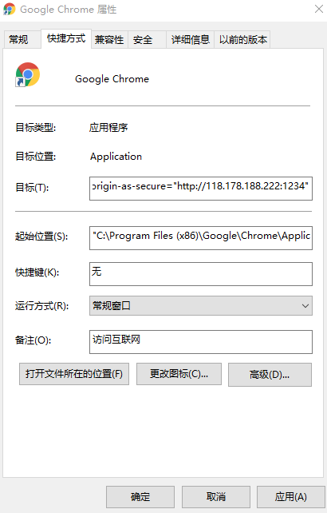

# Shape健身平台

**小程序二维码**：
**Web版项目地址**：http://118.178.188.222:1234

## 小程序Get Start
1. 安装NPM和微信小程序开发工具
2. 把项目Clone到本地，小程序对应front文件夹下的shape-fitness-miniapp
3. 在上述文件夹下执行如下命令
```
$ npm install
```
4. 在微信小程序开发工具中导入项目，点击工具-npm构建
5. 执行如下命令
```
$ npm run build
```
6. 使用你申请的小程序的appid替代``project.config.json``文件中的appid
7. 在你的小程序管理平台中加入``tfjs-wechat``插件，你可以搜索``tensorflow.js``或者``wx6afed118d9e81df9``
8. 在小程序的request合法域名中加入 ``https://www.gstaticcnapps.cn`` 和  ``https://minerw.cafminiapp.ac.cn``
9. 编译预览小程序即可

## Web版安装及使用

安装node.js

安装地址：https://nodejs.org/zh-cn/

安装yarn

```
npm install -g yarn
```

cd 到指定文件夹

```sh
cd shape_web/demos
```

执行命令

```sh
yarn
yarn build
yarn watch
```

## 过程执行截图

yarn命令



yarn build命令



yarn watch命令



## 后端和算法服务部署

在服务器上，通过Dockerfile创建一个docker

`docker build -t shapefitness .`

运行docker

`docker run -it shapefitness /bin/bash  `

即可完成后端和算法服务在服务器端的部署。

## 其他

默认登录口令

用户名：admiin

密码：admin



建议使用chrome打开使用该平台

不安全的http协议使用摄像头权限

右键点击chrome属性，在快捷方式中添加下面的代码



```
--unsafely-treat-insecure-origin-as-secure="http://118.178.188.222:1234"
```

## 致谢
1. [tensorflow/tfjs-models/posenet](https://github.com/tensorflow/tfjs-models/tree/master/posenet)
2. [tensorflow/tfjs-wechat](https://github.com/tensorflow/tfjs-wechat)